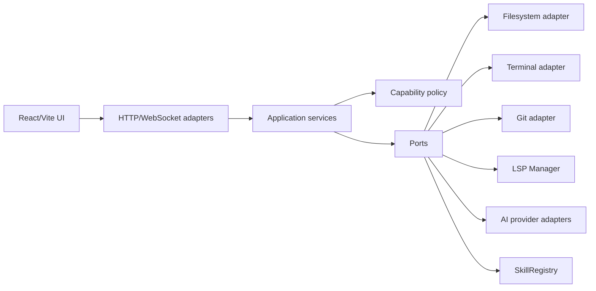
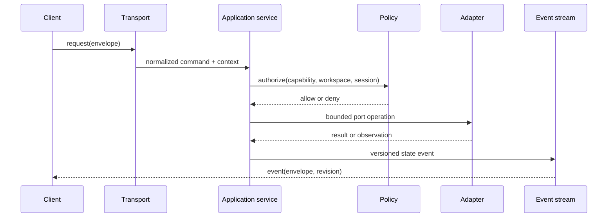
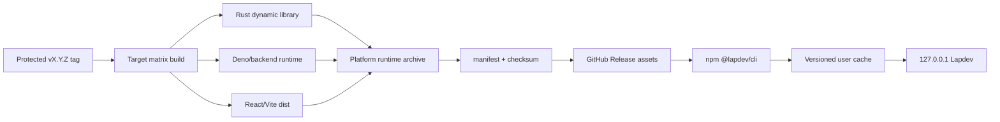

# Architecture Spine — lapdev-platform

## Design Paradigm

Lapdev is a modular monolith. The backend owns application state and exposes capabilities through application services; adapters isolate HTTP/WebSocket transport, filesystem, terminal, Git, LSP, AI providers and skill sources. The frontend is a capability client and view layer, not an owner of workspace state or privileged processes.



## Invariants & Rules

### AD-1 — Capability boundaries are the only privileged entry points

- **Binds:** terminal, file, Git, LSP, AI, Agent and skill operations
- **Prevents:** a route, handler or provider implementing its own authorization and bypassing workspace policy
- **Rule:** every privileged operation enters through an application service with a capability context and policy decision; adapters perform I/O but do not grant authorization.

### AD-2 — The backend owns workspace and session truth

- **Binds:** workspace files, Git state, terminal sessions, LSP state, skill registry state, Agent operations and cross-client events
- **Prevents:** frontend and backend both mutating the same state, stale reconnects overwriting newer state, and clients disagreeing after Agent/file changes
- **Rule:** the backend is the sole owner of external and durable workspace state; frontend state is presentation or temporary input state, and state-changing events carry workspace, session and revision identifiers.

### AD-3 — Cross-module events use one versioned envelope

- **Binds:** HTTP responses, WebSocket messages, file events, terminal output, LSP diagnostics, Agent events and skill refresh events
- **Prevents:** incompatible payload, error, ordering, retry and reconnect behavior between capabilities
- **Rule:** every event uses an envelope containing `type`, `version`, `workspaceId`, `sessionId`, `revision`, `requestId` and the shared error shape; capability-specific data stays inside the payload, while the backend defines ordering and idempotency boundaries.

### AD-4 — Skill discovery is registry-based and source-labelled

- **Binds:** Codex/BMAD skills, legacy Lapdev skills and user-enabled skill sources
- **Prevents:** duplicate loading, invisible precedence rules, stale skill metadata and unexplained missing skills
- **Rule:** `SkillRegistry` parses and indexes `SKILL.md` directories without copying or rewriting them; `.agents/skills` is the primary Codex/BMAD source, `.lapdev/skills` is an explicitly labelled legacy source, and registry results expose source, identity, enabled state, refresh time and errors.

### AD-5 — LSP processes belong to one backend lifecycle manager

- **Binds:** language-server processes, workspace roots, capabilities, diagnostics and editor requests
- **Prevents:** each handler duplicating process startup, cancellation, capability negotiation, crash recovery and cleanup
- **Rule:** the backend `LSP Manager` owns process lifecycle per workspace/session; language-specific behavior is adapter/config data, and the frontend uses LSP through the backend capability only.

### AD-6 — Authorization has application and deployment layers

- **Binds:** local-trusted and remote-shared deployment profiles
- **Prevents:** treating Deno `-A`, browser origin checks or local deployment assumptions as complete authorization
- **Rule:** resolve a capability context for every HTTP/WebSocket session and enforce a policy profile in the application; deploy with the smallest Deno/container permissions that satisfy the selected profile, and audit denials plus high-risk operations.

### AD-7 — Capability adapters do not own cross-capability state

- **Binds:** filesystem watcher, terminal, Git, LSP, AI, Agent and skill adapters
- **Prevents:** duplicated workspace/session entities and divergent mutation paths
- **Rule:** shared workspace/session state is owned by application services; adapters report observations and execute bounded commands through ports, while state transitions and emitted revisions are decided centrally.

### AD-8 — The npm CLI is the local release boundary

- **Binds:** end-user installation, version selection, runtime acquisition, local startup and source-install compatibility
- **Prevents:** coupling the primary delivery path to Docker/ACR or making the npm package carry every native artifact directly
- **Rule:** `@lapdev/cli` owns `web`, `doctor` and `version` commands, platform selection, runtime cache, integrity checks and backend startup; the source checkout remains a supported contributor path.

### AD-9 — CLI and runtime bind through a versioned manifest

- **Binds:** CLI version, GitHub Release tag, platform/architecture, asset URL, size, checksum and build commit
- **Prevents:** CLI/runtime version drift, partial downloads and opaque startup failures
- **Rule:** the CLI accepts only a matching manifest and checksum-verified runtime; downloads use temporary files and install atomically into a versioned user cache.

### AD-10 — Rust FFI artifacts are explicit runtime files

- **Binds:** Deno FFI, operating-system dynamic loaders and the runtime archive layout
- **Prevents:** current-working-directory dependence, assuming native libraries are automatically embedded, and cross-platform ABI mixing
- **Rule:** each runtime archive has a stable `bin/`, `lib/` and `app/` layout; the backend resolves the platform library relative to its module/runtime location and never from an arbitrary workspace path.

### AD-11 — Git tags are the release authority

- **Binds:** GitHub Release assets, npm CLI publication, CI permissions, provenance and rollback
- **Prevents:** long-lived npm credentials, ACR manifest publication as a release gate, and independent CLI/runtime versions
- **Rule:** protected `v*` tags create the runtime Release and publish the CLI through npm Trusted Publishing; pull requests build and test but never publish release assets.

### AD-12 — Platform builds use one explicit target matrix

- **Binds:** Rust Cargo targets, Deno targets, CLI platform/architecture selection and smoke tests
- **Prevents:** success on the GitHub runner host masking failure on the user's platform
- **Rule:** the first supported targets are `linux-x64` and `darwin-arm64`; later targets (`linux-arm64`, `darwin-x64`, `win32-x64`) extend the same manifest and health contract rather than inventing separate packaging rules.

### AD-13 — Runtime acquisition is local-first and least-exposure

- **Binds:** CLI download/cache behavior, workspace boundaries and local-trusted/remote-shared deployment profiles
- **Prevents:** installation widening network exposure, runtime assets entering the workspace, and secrets being shipped in release archives
- **Rule:** bind to `127.0.0.1` by default, cache under the user's application data directory, keep runtime archives free of secrets/workspace data, and require an explicit `--host` to change binding.

## Consistency Conventions

| Concern | Convention |
| --- | --- |
| Naming | Use capability names consistently across application service, port, adapter and event type; use `workspaceId`, `sessionId`, `requestId` and `revision` in every cross-boundary contract. |
| Data & formats | Version event envelopes; keep capability payloads namespaced by event type; represent errors with one serializable shape and never include secrets or raw provider credentials. |
| State & cross-cutting | Backend application services own mutations; policy is evaluated before adapter I/O; every high-risk operation has correlation data and an auditable outcome. |
| Compatibility | New event consumers must tolerate unknown fields; event type/version changes require an explicit compatibility decision rather than silent shape drift. |
| Skill sources | `.agents/skills` is primary; `.lapdev/skills` is legacy and must remain visibly labelled in registry output. |

## Stack

| Name | Version |
| --- | --- |
| React | 19.2.x (frontend manifest) |
| Vite | 6.x (frontend manifest) |
| TypeScript | 5.5.x frontend; 5.4.x root tooling |
| Deno | 2.8.2 (CI `DENO_VERSION`) |
| Vitest | 2.0.5 |
| Playwright | 1.60.0 |
| Rust edition | 2021 |

| CLI | Node.js launcher published as `@lapdev/cli`; versioned `web`/`doctor`/`version` contract |
| Runtime release | GitHub Release assets keyed by Git tag + platform/architecture manifest |
| Package publication | npm Trusted Publishing via GitHub Actions OIDC; no long-lived publish token |

## Structural Seed

```text
lapdev/
  cli/ or packages/cli/     # npm CLI: platform selection, cache, integrity and startup
  frontend/                 # React/Vite view and capability client
  backend/src/
    main.ts                 # transport entrypoint and route/WS boundary
    services/               # application services and capability orchestration
    adapters/               # external process, filesystem, Git, AI and protocol adapters
  core/                     # Rust core; accessed through an explicit port/adapter boundary
  shared/                   # transport-safe shared types only
  .agents/skills/           # primary Codex/BMAD skill source
  .lapdev/skills/            # legacy skill source, compatibility only
  _agile-output/             # current BMAD planning, implementation and test artifacts
  docs/                      # project knowledge and human-facing documentation
  .github/workflows/         # CI quality gates and tag-driven runtime/npm release workflows
```





## Deferred

- Select the concrete authentication provider and token/session mechanism for remote-shared mode; the current repository does not establish one.
- Define tenant/workspace isolation and terminal command allowlists for remote-shared mode; this requires a threat-model and deployment decision.
- Decide whether `implementation_artifacts/sprint-status.yaml` is migrated into `_agile-output/implementation-artifacts/` or retained as an archive link.
- Define persistence technology for registry/session/event history only when the current in-memory or file-backed behavior is insufficient; the spine fixes ownership and contracts, not storage implementation.
- Define the full public API schema and generated client strategy after the event envelope is implemented and real consumers are inventoried.
- Decide whether Rust core functionality should remain a local adapter or become a separately deployed service; current code does not require service extraction.
- Confirm GitHub Release reachability and offline-install requirements for target users; the architecture fixes the contract but not a mirror provider.
- Confirm whether Windows is a first-wave target and select signing/attestation verification beyond SHA-256 before broad release.

## Capability → Architecture Map

| Capability / Area | Lives in | Governed by |
| --- | --- | --- |
| Workspace/files | backend application services + filesystem adapter | AD-1, AD-2, AD-7 |
| Terminal | terminal application service + process adapter | AD-1, AD-6, AD-7 |
| Git | Git application service + Git adapter | AD-1, AD-2, AD-7 |
| LSP | LSP Manager + language adapters | AD-1, AD-2, AD-5 |
| AI/Agent | AI and Agent application services + provider/file adapters | AD-1, AD-2, AD-6 |
| Skills | SkillRegistry + source adapters | AD-1, AD-4 |
| HTTP/WebSocket | transport adapters and event stream | AD-2, AD-3, AD-6 |
| BMAD artifacts | `_agile-output/` workflow boundary | AD-2, consistency conventions |
| npm CLI | `cli/` or `packages/cli/` launcher and runtime client | AD-8, AD-9, AD-13 |
| Runtime packaging | release builder, target matrix and archive layout | AD-10, AD-11, AD-12 |
| Release delivery | protected tag workflow, GitHub Release and npm publication | AD-9, AD-11, AD-12 |
