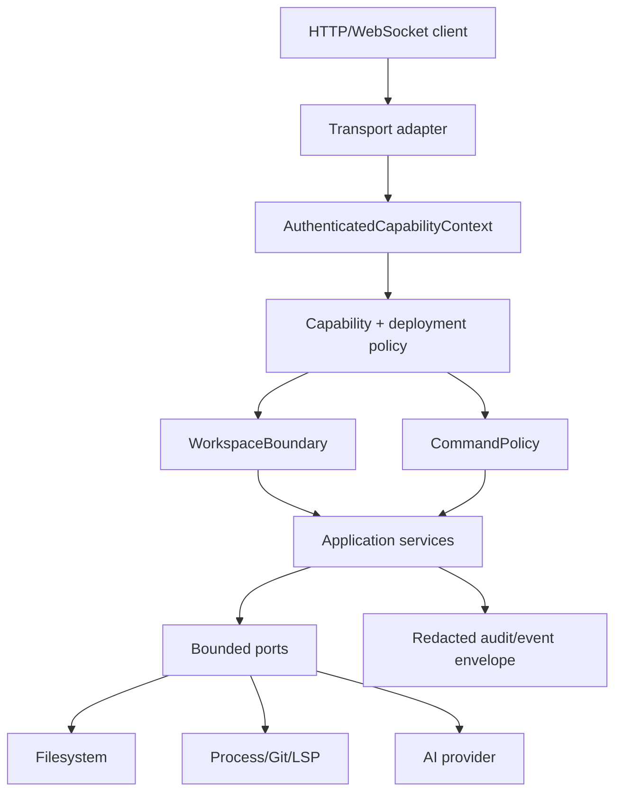
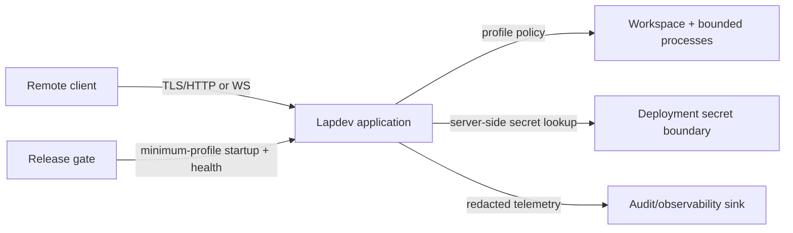

# Architecture Spine — lapdev-remote-security

## Design Paradigm

Lapdev remains a modular monolith. HTTP and WebSocket transport adapters resolve an authenticated capability context, application services enforce workspace and policy boundaries, and bounded adapters perform filesystem, process, Git, LSP and AI I/O. Deployment permissions are a separate outer boundary around the same application policy.

## Inherited Invariants

| Inherited | From parent | Binds here |
| --- | --- | --- |
| AD-1 | `architecture-lapdev-2026-09-28` | All remote privileged operations enter through application services; adapters do not grant authorization. |
| AD-2 | `architecture-lapdev-2026-09-28` | Backend owns workspace/session truth and remote state changes. |
| AD-3 | `architecture-lapdev-2026-09-28` | Authentication, authorization and audit events use the versioned event envelope. |
| AD-5 | `architecture-lapdev-2026-09-28` | LSP remains owned by the backend LSP Manager. |
| AD-6 | `architecture-lapdev-2026-09-28` | Application policy and deployment permissions remain separate least-privilege layers. |
| AD-7 | `architecture-lapdev-2026-09-28` | Adapters report observations and perform bounded I/O; shared state transitions remain centralized. |

## Invariants & Rules

### AD-8 — Authenticated capability context is the single remote entry contract

- **Binds:** CAP-1, CAP-2, HTTP and WebSocket transport
- **Prevents:** HTTP and WebSocket implementing divergent identity, session or capability checks
- **Rule:** Transport adapters must resolve the same `AuthenticatedCapabilityContext` containing principal, workspace, session, deployment profile and requested capability before invoking an application service; remote-shared v1 exchanges a deployment-injected bootstrap token for a short-lived server-side opaque session, and Origin checks are auxiliary only.

### AD-9 — Workspace isolation is enforced by one backend boundary

- **Binds:** CAP-2, file, Agent, Git, terminal, LSP and AI operations
- **Prevents:** path, workspace identifier or symlink checks drifting between adapters
- **Rule:** A `WorkspaceBoundary` service normalizes and authorizes workspace handles before adapter I/O; adapters receive only an authorized handle and cannot accept arbitrary host paths or workspace identifiers.

### AD-10 — Remote policy is explicit deny-by-default

- **Binds:** CAP-2, CAP-3 and remote-shared policy
- **Prevents:** local-trusted permissions leaking into remote sessions or newly added capabilities becoming implicitly public
- **Rule:** Remote policy explicitly evaluates capability, cwd, executable/arguments, environment, network target, resource limits and interactive mode; absent policy entries deny the request. In v1 arbitrary shell is disabled, Git is limited to an explicit read-only set, and LSP is limited to configured executables.

### AD-11 — Command execution has one policy gate and one bounded process port

- **Binds:** CAP-3, terminal, Git and subprocess operations
- **Prevents:** shell wrappers, alternate handlers or Git helpers bypassing command restrictions
- **Rule:** `CommandPolicy` evaluates the normalized executable, arguments, environment and cwd before a `ProcessPort` executes; shell composition and disallowed values are rejected and every decision emits a redacted audit event.

### AD-12 — Remote secrets remain server/deployment side

- **Binds:** CAP-2, AI providers, configuration, logs, events and audit
- **Prevents:** API keys or complete sensitive prompts crossing the browser or appearing in telemetry
- **Rule:** Remote clients receive capability/configuration status, never secret material; v1 resolves AI credentials from deployment environment injection inside backend provider adapters, and all logs, errors, events and audit payloads pass redaction before emission.

### AD-13 — Deployment permission profiles are executable contracts

- **Binds:** CAP-4, entrypoint, Deno, container, health checks and release pipeline
- **Prevents:** a green image relying on undocumented `-A` or container-wide permissions
- **Rule:** Each deployment profile declares required filesystem, network, environment and subprocess permissions; `remote-shared-v1` binds one workspace root, allows only fixed Git/LSP executables, denies arbitrary shell, startup self-checks the profile, and the release gate proves health plus representative allow/deny behavior under the smallest tested permission set.

### AD-14 — Security decisions are correlated and envelope-compatible

- **Binds:** CAP-1 through CAP-4, audit and telemetry
- **Prevents:** denied, expired, cross-workspace and process-policy outcomes becoming untraceable or exposing raw sensitive input
- **Rule:** Audit and security telemetry reuse the inherited `type`, `version`, `workspaceId`, `sessionId`, `requestId` and `revision` envelope fields, record decision summaries and outcomes, and never record secrets, raw credentials or complete prompts.



## Consistency Conventions

| Concern | Convention |
| --- | --- |
| Identity and scope | Use `principalId`, `workspaceId`, `sessionId`, `requestId` and `revision`; never infer authorization from browser Origin or an untrusted path. |
| Policy | Name profiles `local-trusted` and `remote-shared`; remote rules are deny-by-default and capability-specific. |
| Paths and commands | Pass normalized workspace handles and normalized command decisions across ports; adapters never re-authorize by accepting broader input. |
| Errors and audit | Use the inherited versioned envelope and shared redacted error shape; include decision reason and correlation data, not secrets. |
| Secrets | Keep key material server/deployment side; redact logs, events, telemetry, fixtures and error serialization by default. |
| Deployment | Treat entrypoint permissions, container permissions, Deno permissions and health checks as one named profile tested in CI. |

## Stack

| Name | Version |
| --- | --- |
| React | 19.2.x |
| Vite | 6.x |
| Deno | 2.8.2 |
| Rust edition | 2021 |

## Structural Seed

```text
lapdev/
  backend/src/
    auth/                 # authenticated session/context resolution
    services/             # policy, workspace boundary and application orchestration
    adapters/             # bounded filesystem, process, Git, LSP and AI I/O
  scripts/entrypoint.sh   # selected deployment profile and startup self-check
  .github/workflows/      # release permission and health gates
  _agile-output/          # security SPEC, architecture and implementation evidence
```



## Capability → Architecture Map

| Capability / Area | Lives in | Governed by |
| --- | --- | --- |
| CAP-1 authenticated remote sessions | transport adapters + session/auth application service | AD-8, AD-14 |
| CAP-2 isolated workspace operations | WorkspaceBoundary + capability application services | AD-1, AD-2, AD-9, AD-10, AD-12 |
| CAP-3 constrained command execution | CommandPolicy + ProcessPort + terminal/Git services | AD-10, AD-11, AD-14 |
| CAP-4 least-privilege release deployment | entrypoint, container/permission profile and CI release gate | AD-6, AD-13 |

## Deferred

- Replace the v1 deployment-injected token with an external identity provider when public or multi-user deployment becomes a committed product scope.
- Define workspace membership and tenant hierarchy before enabling public multi-tenant access.
- Expand the v1 command, network-target and resource policy catalog only after deployment owners provide operational constraints and tests.
- Admit additional LSP executables only through explicit adapter review and profile tests.
- Adopt an external secret store when deployment rotation, multi-user ownership or compliance requires it; v1 remains environment-injected.
