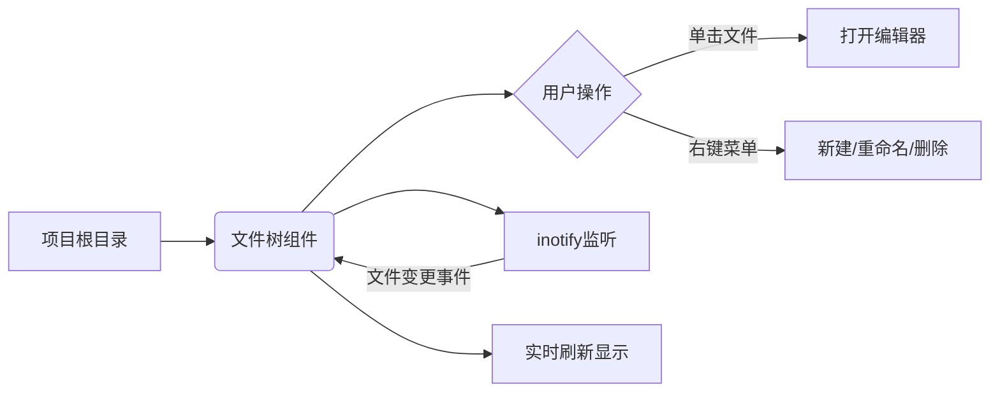
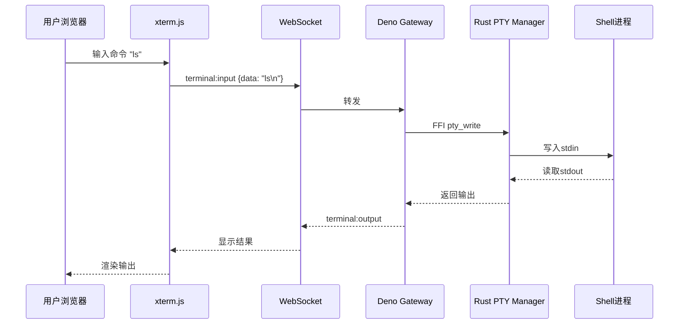
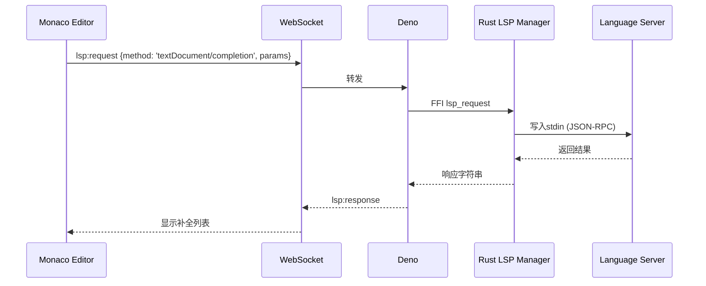
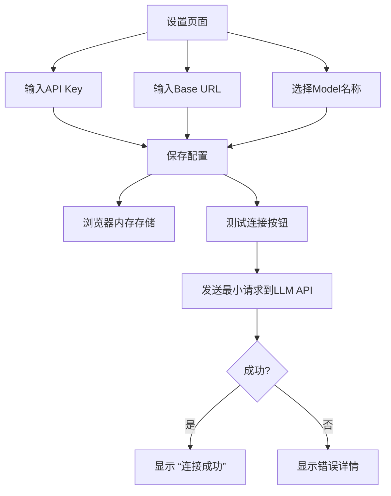
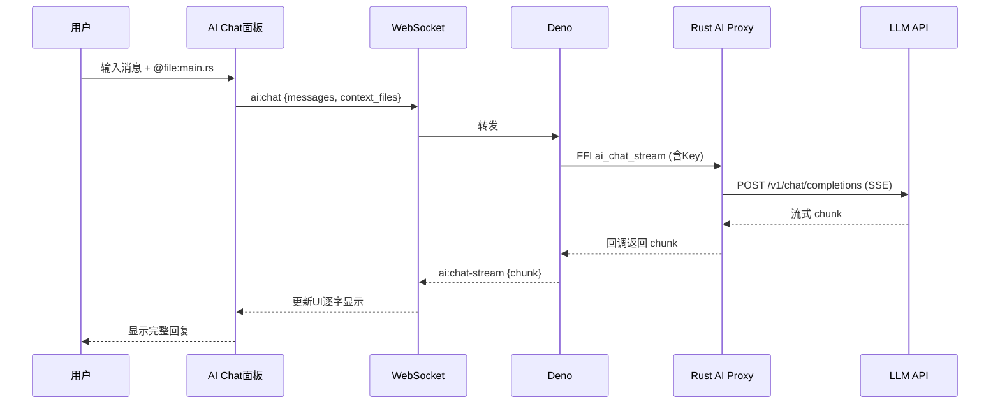
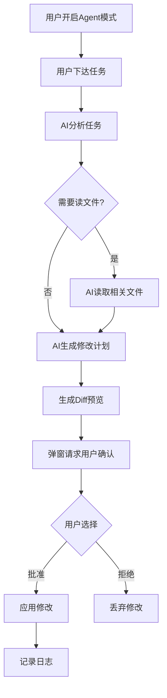
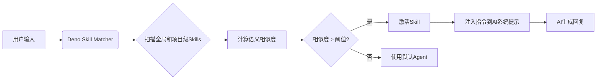
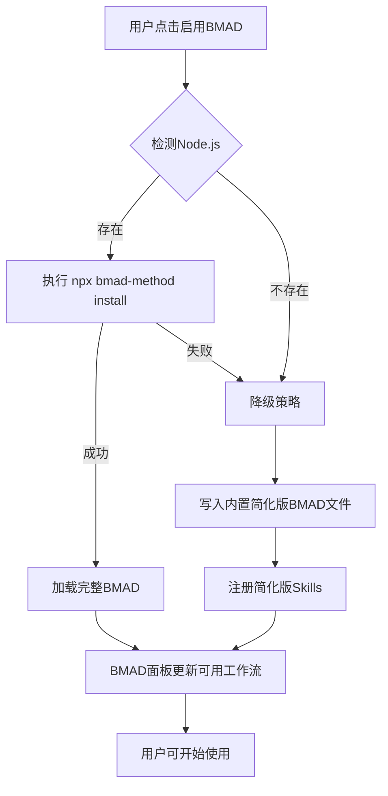
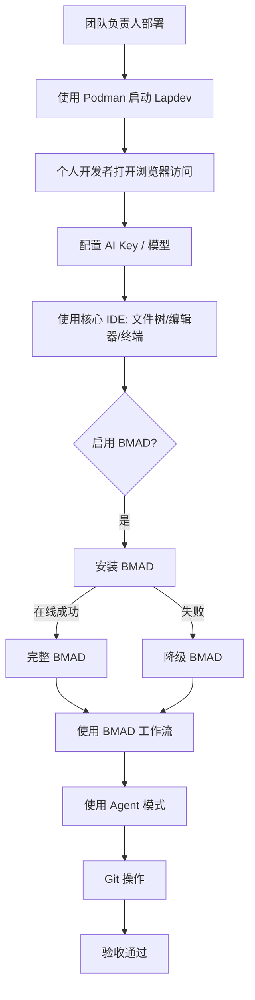

# Lapdev 项目需求文档 - 用户故事与验收标准

## 1. 概述
本文档以用户故事（User Story）的方式定义 Lapdev 的全部功能需求。每个用户故事都附有详细的验收标准，并通过 Mermaid 图表对关键流程进行可视化说明，以便团队准确理解需求。

## 2. 用户角色

| 角色 | 描述 |
| :--- | :--- |
| **个人开发者** | 使用 Lapdev 进行日常编码，希望获得流畅的 AI 辅助。 |
| **团队负责人** | 负责为团队搭建和维护开发环境，关注部署成本、数据隐私与稳定性。 |
| **社区贡献者** | 为 Lapdev 开发 Skill 或贡献核心代码。 |

## 3. 用户故事与验收标准

### 3.1 核心 IDE 功能

**US-01: 文件树浏览与管理**
> 作为个人开发者，我希望在浏览器中看到一个实时的文件树，以便导航和操作我的项目文件。

- **验收标准**：
  - 打开工作区后，文件树立即显示根目录下的所有文件和文件夹。
  - 文件夹可展开/折叠，并遵循 `.gitignore` 忽略规则。
  - 文件树实时更新：若在外部创建、修改或删除文件，树在 3 秒内自动刷新。
  - 右键菜单支持新建文件/文件夹、重命名、删除操作。
  - 单击文件可在编辑器中打开其内容。

---

**US-02: 现代代码编辑器体验**
> 作为个人开发者，我希望有一个功能全面的代码编辑器，以便高效编写代码。

- **验收标准**：
  - 支持语法高亮、括号匹配、代码折叠、缩进指南。
  - 多光标编辑可用。
  - 支持至少深浅两套主题，可在设置中即时切换。
  - 已打开的文件以 Tab 标签形式显示，支持 Tab 拖动排序。
  - 可通过快捷键 `Ctrl+S` 保存文件，`Ctrl+W` 关闭 Tab。

---

**US-03: 内置终端**
> 作为个人开发者，我希望在 IDE 中直接使用终端，执行命令和脚本。

- **验收标准**：
  - 底部面板可打开完整的终端仿真器（基于 xterm.js）。
  - 终端连接到服务器上的真实 Shell（如 bash），并正确显示提示符。
  - 支持多个终端 Tab，可添加、关闭和重命名。
  - 终端尺寸可拖动调整，调整后发送 SIGWINCH 至 PTY。
  - 输入命令到显示结果的延迟 < 50ms。

---

**US-04: Git 版本控制可视化**
> 作为个人开发者，我希望 IDE 能直观展示 Git 状态，并执行常用操作。

- **验收标准**：
  - 文件树中通过图标/颜色区分文件状态：已修改、新增、未跟踪。
  - 编辑器边栏（Gutter）显示当前文件与 HEAD 的差异指示（绿色新增、蓝色修改、红色删除）。
  - 侧边 Git 面板可查看变更文件列表，点击打开 diff 视图。
  - 支持一键暂存所有变更，填写提交信息并提交。
  - 支持切换已有分支。

---

**US-05: LSP 代码智能（第一阶段：Rust & TypeScript）**
> 作为个人开发者，我希望获得代码自动补全、错误诊断和导航功能，以提高编码效率。

- **验收标准**：
  - 打开 `.rs` 或 `.ts` 文件时，底部状态栏显示 LSP 初始化状态（“Rust Analyzer 已就绪”）。
  - 输入代码时实时显示补全候选列表，包含方法签名和文档。
  - 悬停在符号上显示类型信息和文档。
  - 按 `F12` 跳转到定义，`Shift+F12` 查找所有引用。
  - 错误和警告以波浪线突出显示，并出现在“问题”面板中。

---

### 3.2 AI 功能（BYOK）

**US-06: AI 模型配置**
> 作为个人开发者，我希望在设置页面填入我的 API Key 和模型信息，以便使用自己的 AI 服务。

- **验收标准**：
  - 设置页面提供表单：API Key（密码框）、Base URL（默认可选 OpenAI / DeepSeek / 自定义）、Model 名称。
  - 点击“测试连接”按钮可发送一个简单请求，返回成功或失败提示。
  - 配置在浏览器会话期间有效，刷新后需重新输入（Key 不持久化）。
  - 可添加多个模型配置，并选择一个作为“当前活跃模型”。
  - 所有日志和网络面板中不得暴露明文 API Key。

---

**US-07: AI 聊天面板**
> 作为个人开发者，我希望通过侧边栏聊天窗口与 AI 对话，并引用我的代码上下文。

- **验收标准**：
  - 侧边栏可打开 AI Chat 面板。
  - 输入框支持普通文本和 `@file:path` 引用文件，`@selection` 引用当前选中的代码。
  - AI 回复以流式方式逐字显示（类似 ChatGPT）。
  - 对话历史在同一个会话内保留，支持新建会话和清空历史。
  - 若未配置 AI Key，面板显示引导提示“请先在设置中配置 AI”。

---

**US-08: AI 内联代码补全**
> 作为个人开发者，我希望能获得 AI 的内联代码建议，更快完成代码行。

- **验收标准**：
  - 在编辑器中暂停输入（可配置延迟，如 500ms）后，自动触发补全请求。
  - 建议以幽灵文本形式显示在当前光标位置。
  - 按 `Tab` 接受建议，`Esc` 取消。
  - 可通过设置开关启用/禁用该功能。
  - 仅使用用户配置的 AI 模型。

---

**US-09: Agent 模式（谨慎操作）**
> 作为个人开发者，我希望 AI Agent 能自动执行任务，但任何文件修改都需要我确认。

- **验收标准**：
  - 在 AI 面板中开启 Agent 模式后，AI 可以自主读取文件和搜索代码。
  - 当 AI 决定修改文件时，编辑器自动显示 diff 预览，并弹出确认对话框：“AI 建议修改以下文件：[列表]，是否应用？”
  - 用户可逐个批准或拒绝，也可以一次性全部批准。
  - 所有 Agent 操作记录在活动日志中，便于审计。

---

### 3.3 Skill 系统

**US-10: Skill 开发与加载**
> 作为社区贡献者，我希望编写一个简单的 `.skill.md` 文件，Lapdev 能自动加载它，为 AI 增加新能力。

- **验收标准**：
  - 提供清晰的 Skill 规范文档，定义 YAML 元数据和 Markdown 指令。
  - 将 `.skill.md` 放入 `~/.lapdev/skills/`（全局）或 `.lapdev/skills/`（项目级），重启或重新加载后生效。
  - 通过 CLI 命令 `lapdev skill install <name>` 可从市场安装官方 Skill。
  - Skill 加载后，在 AI 的系统提示中注入其指令。

**US-11: Skill 自动匹配**
> 作为个人开发者，我希望 AI 能根据我的问题自动启用合适的 Skill。

- **验收标准**：
  - AI Agent 在接收用户请求时，扫描已加载 Skill 的描述。
  - 若匹配度超过阈值（如语义相似度 > 0.7），自动激活该 Skill，并在 AI 面板顶部显示“已激活 Skill: [名称]”。
  - 用户可手动禁用已激活的 Skill。

---

### 3.4 BMAD 敏捷方法论支持

**US-12: BMAD 一键启用**
> 作为个人开发者，我希望在新项目或现有项目中一键启用 BMAD 工作流。

- **验收标准**：
  - 项目打开时，若根目录无 `_bmad` 文件夹，Lapdev 在 BMAD 面板显示“启用 BMAD 工作流”按钮。
  - 点击按钮后，系统首先尝试执行 `npx bmad-method install`（需要 Node.js）。
  - 若在线安装成功，项目下生成完整的 `_bmad` 目录，BMAD 面板显示所有可用工作流和智能体。
  - 安装成功后，Skill 注册表自动添加 BMAD 相关技能。

**US-13: BMAD 离线降级**
> 作为个人开发者，当网络或 Node.js 不可用时，我仍希望使用基本的 BMAD 工作流。

- **验收标准**：
  - 在线安装失败或 Node.js 不可用，系统自动切换至降级策略。
  - 内置简化版 BMAD 文件被直接写入项目 `_bmad/core/` 目录。
  - 简化版包含：`quick-flow` 工作流、`developer` 和 `pm` 智能体。
  - 降级安装完成后，AI 面板自动加载 `bmad-quick-flow` 技能，用户可立即使用。
  - 系统保留“重试在线安装”按钮，用户可随时升级。

---

### 3.5 部署与国内环境适配

**US-14: Podman 原生支持**
> 作为团队负责人，我希望使用 Podman 部署 Lapdev，并通过国内镜像加速。

- **验收标准**：
  - 项目提供 `podman-compose.yml` 文件，一键启动 Lapdev 及其依赖。
  - 提供 `scripts/setup_podman.sh`，自动化安装 Podman、配置镜像加速（阿里云等）。
  - Dockerfile 构建的镜像可直接在 Podman 中使用。
  - 文档明确说明如何配置国内镜像源、加载离线镜像包。

**US-15: 国内代码托管与社区**
> 作为个人开发者，我希望代码和社区资源能在国内高速访问。

- **验收标准**：
  - Lapdev 主仓库托管在 Gitee，提供稳定快速的 Git 操作和 Issue/PR 入口。
  - GitHub 仓库通过 Gitee 镜像功能自动同步，确保国际可见度。
  - Gitee 仓库启用 DevOps CI，自动化测试和构建镜像。
  - 官方文档、论坛（可选）均优先使用国内可访问的服务。

---

## 4. 整体系统验收流程

以下 Mermaid 图展示了从部署到 BMAD 使用的端到端验收流程：

---

## 5. 验收总结

项目交付时，必须满足以下全局条件：

1. 在无网环境通过 Podman 启动，新建项目可自动启用降级 BMAD。
2. 有网环境下可在线安装完整 BMAD 并正常使用。
3. 用户 API Key 配置后，AI 聊天、内联补全、Agent 模式功能均可正常工作。
4. 核心 IDE 功能（文件管理、编辑器、终端、Git）无明显缺陷。
5. 所有代码在 Gitee 公开，遵循 MIT 协议，并与 GitHub 仓库同步。
