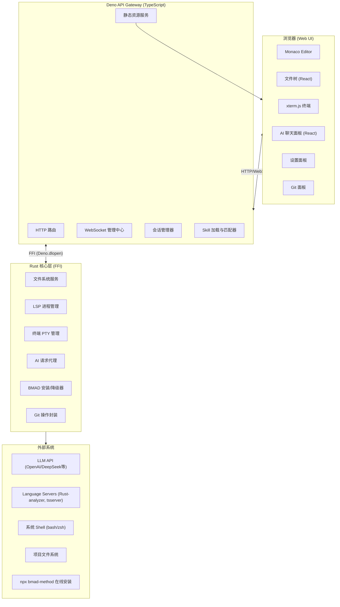
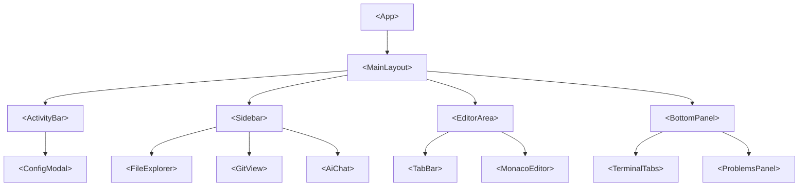
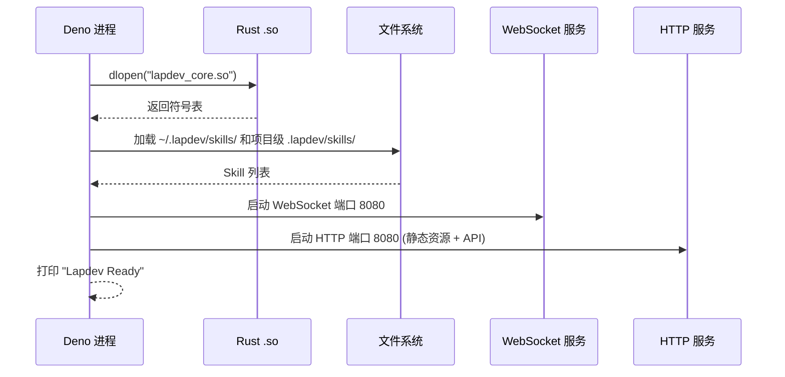
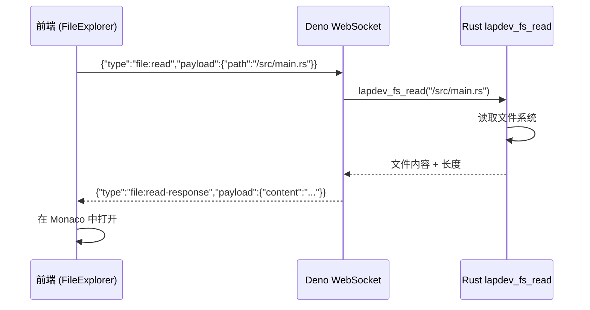
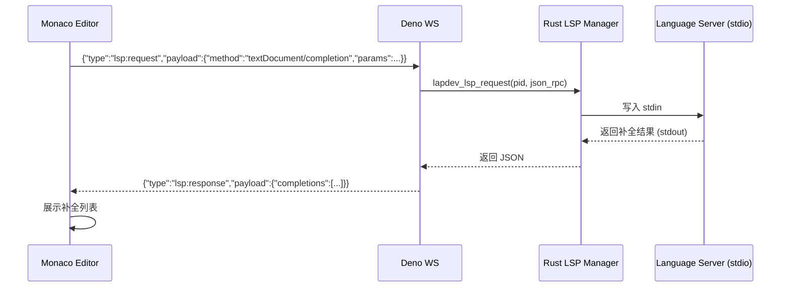
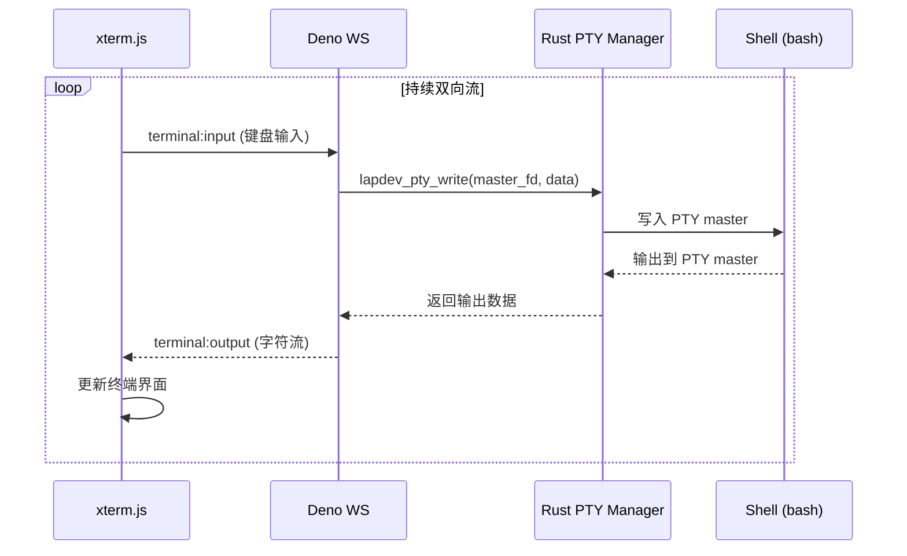
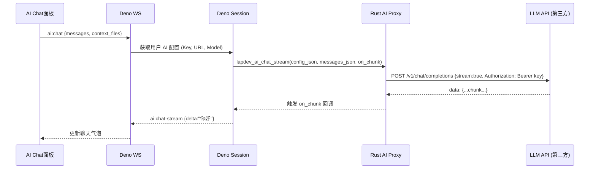
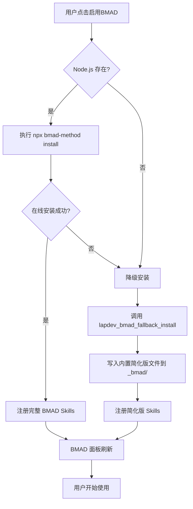
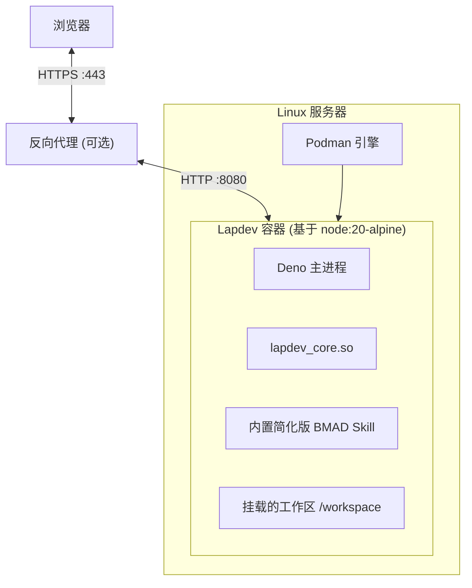
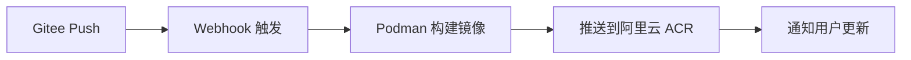

# Lapdev 项目设计文档

## 1. 文档概述

### 1.1 文档目的
本文档定义 Lapdev Web IDE 的完整技术设计方案，包括架构分层、核心模块职责、数据流转路径、API 与通信协议、部署拓扑及安全策略。文档面向项目开发团队，作为后续实现与评审的基准。

### 1.2 设计目标
- **高性能**：利用 Rust 处理 I/O 密集型与 CPU 密集型核心逻辑，保证毫秒级响应。
- **可扩展**：通过 Skill 系统与 FFI 接口，允许社区自由扩展 AI 能力与底层功能。
- **全开源与国产化适配**：MIT 协议，优先支持 Podman、国内镜像源、Gitee 主站。
- **安全隐私**：用户 AI Key 只存于会话内存，所有敏感操作须用户授权。

---

## 2. 技术架构总览

### 2.1 分层架构



### 2.2 技术栈清单

| 层级 | 技术 | 选型理由 |
| :--- | :--- | :--- |
| **前端** | React + TypeScript + Vite | 组件化开发，类型安全，构建迅速 |
| **编辑器** | Monaco Editor (独立组件) | VS Code 同源内核，不依赖 VS Code 平台 |
| **终端** | xterm.js + Rust `portable-pty` | 成熟稳定的 Web 终端方案，Rust 高性能 PTY 管理 |
| **后端网关** | Deno + TypeScript | 内置 Web 标准 API、安全默认、原生 TS 支持 |
| **核心库** | Rust (编译为 .so) | 系统级性能、内存安全、零成本抽象 |
| **通信** | WebSocket + HTTP REST | WS 处理实时双向流，HTTP 处理配置与一次性操作 |
| **容器** | Podman (兼容 Docker) | 无守护进程、Rootless 友好、国内镜像源可用 |
| **代码托管** | Gitee (主) + GitHub (镜像) | 国内高速访问，国际社区同步 |

---

## 3. 核心模块详细设计

### 3.1 前端 Web 应用 (`lapdev-web`)

前端基于 React 构建单页应用，通过 Vite 打包为静态资源，由 Deno 直接服务。

**核心组件树：**


**组件职责简述：**
- `FileExplorer`：展示文件树，调用 WS `file:*` 消息。
- `MonacoEditor`：封装 Monaco，通过 WS `lsp:*` 获取智能提示。
- `TerminalTabs`：管理多个 xterm.js 实例，收发 `terminal:*` 消息。
- `AiChat`：AI 对话界面，发送 `ai:chat`，接收 `ai:chat-stream`。
- `ConfigModal`：模型配置表单，调用 HTTP API 保存/测试。
- `GitView`：展示变更文件，触发 HTTP API 或 WS 消息进行 Git 操作。

### 3.2 Deno 后端网关 (`lapdev-server`)

Deno 负责 HTTP/WS 入口、静态文件服务、会话保持、Skill 调度，以及与 Rust 核心的 FFI 通信。

**启动流程：**


**核心类型定义（TypeScript）：**
```typescript
// 会话对象
interface Session {
  id: string;
  socket: WebSocket;
  workspaceRoot: string;
  aiConfig?: AIConfig;
}

interface AIConfig {
  apiKey: string;
  baseUrl: string;
  model: string;
}

// Skill 定义
interface Skill {
  name: string;
  description: string;
  version: string;
  markdownContent: string;  // 给 AI 的系统指令
  source: 'global' | 'project' | 'market';
}
```

### 3.3 Rust 核心库 (`lapdev-core`)

Rust 编译为动态链接库，通过 C ABI 暴露函数供 Deno 调用。内部使用 `tokio` 异步运行时处理 LSP 通信、文件监听等。

**主要 FFI 函数声明（Rust 侧 C 接口）：**
```c
// 文件服务
int32_t lapdev_fs_read(const char* path, char** out_buf, int32_t* out_len);
int32_t lapdev_fs_write(const char* path, const char* content, int32_t len);
int32_t lapdev_fs_watch(const char* path, void (*callback)(const char*, const char*));

// LSP
int32_t lapdev_lsp_start(const char* language, const char* root_path, int32_t* pid);
int32_t lapdev_lsp_request(int32_t pid, const char* json_rpc, char** out_buf);
void    lapdev_lsp_set_callback(int32_t pid, void (*callback)(const char*));

// 终端
int32_t lapdev_pty_spawn(const char* shell, int32_t rows, int32_t cols, int32_t* pid, int32_t* master_fd);
int32_t lapdev_pty_write(int32_t master_fd, const uint8_t* data, int32_t len);
int32_t lapdev_pty_read(int32_t master_fd, char** out_buf, int32_t* out_len);
int32_t lapdev_pty_resize(int32_t master_fd, int32_t rows, int32_t cols);

// AI 代理
int32_t lapdev_ai_chat_stream(const char* config_json, const char* messages_json,
                               void (*on_chunk)(const char*));
int32_t lapdev_ai_complete(const char* config_json, const char* code_before, const char* code_after,
                            char** out_suggestion);

// BMAD
int32_t lapdev_bmad_online_install(const char* project_root);
int32_t lapdev_bmad_fallback_install(const char* project_root);
```

---

## 4. 数据流图

### 4.1 文件读取流程



### 4.2 LSP 补全流程



### 4.3 终端 I/O 流程



### 4.4 AI 流式聊天流程



### 4.5 BMAD 降级安装流程



---

## 5. 接口定义

### 5.1 WebSocket 消息协议

所有实时消息走单一 WebSocket 连接，消息为 JSON 格式：

```json
{
  "type": "消息类型",
  "payload": { }
}
```

#### 消息类型表

| 类型 (type) | 方向 | Payload 结构 | 说明 |
| :--- | :--- | :--- | :--- |
| `file:read` | C→S | `{ "path": "/src/main.rs" }` | 请求读取文件 |
| `file:read-resp` | S→C | `{ "path": "...", "content": "..." }` | 返回文件内容 |
| `file:write` | C→S | `{ "path": "...", "content": "..." }` | 请求写入文件 |
| `file:change` | S→C | `{ "event": "create|delete|modify", "path": "..." }` | 文件系统变更通知 |
| `lsp:request` | C→S | `{ "pid": 1, "jsonrpc": "{...}" }` | LSP 请求 |
| `lsp:response` | S→C | `{ "pid": 1, "jsonrpc": "{...}" }` | LSP 响应 |
| `lsp:diagnostics` | S→C | `{ "pid": 1, "diagnostics": [...] }` | 推送诊断信息 |
| `terminal:input` | C→S | `{ "id": "term1", "data": "字符串" }` | 终端输入 |
| `terminal:output` | S→C | `{ "id": "term1", "data": "字符串" }` | 终端输出 |
| `terminal:resize` | C→S | `{ "id": "term1", "rows": 40, "cols": 120 }` | 改变终端尺寸 |
| `ai:chat` | C→S | `{ "messages": [...], "context": [...] }` | 发起 AI 对话 |
| `ai:chat-stream` | S→C | `{ "delta": "文本片段", "finish": false }` | 流式 AI 回复 |
| `ai:complete` | C→S | `{ "code_before": "...", "code_after": "..." }` | 请求补全 |
| `ai:complete-result` | S→C | `{ "suggestion": "..." }` | 补全结果 |
| `ai:agent-action` | S→C | `{ "action": "write_file", "path": "...", "diff": "..." }` | Agent 请求执行 |
| `ai:agent-approve` | C→S | `{ "action_id": "...", "approved": true }` | 用户批准/拒绝 |
| `git:status` | C→S | `{}` | 请求 Git 状态 |
| `git:status-resp` | S→C | `{ "files": [...] }` | 返回文件状态列表 |
| `git:commit` | C→S | `{ "message": "fix: ...", "files": [...] }` | 提交变更 |

### 5.2 HTTP REST API

| 方法 | 路径 | 请求体 | 响应 | 描述 |
| :--- | :--- | :--- | :--- | :--- |
| `GET` | `/api/workspace/tree` | - | `{ "root": {...} }` | 获取文件树 |
| `POST` | `/api/workspace/file` | `{ "path": "...", "type": "file|folder" }` | `{ "ok": true }` | 创建文件/文件夹 |
| `DELETE` | `/api/workspace/file` | `{ "path": "..." }` | `{ "ok": true }` | 删除文件/文件夹 |
| `GET` | `/api/skills` | - | `[Skill]` | 列出已加载 Skills |
| `POST` | `/api/skills/install` | `{ "name": "..." }` | `{ "ok": true }` | 从市场安装 Skill |
| `POST` | `/api/bmad/install` | - | `{ "status": "online|fallback" }` | 触发 BMAD 安装 |
| `GET` | `/api/bmad/status` | - | `{ "installed": true, "version": "..." }` | BMAD 状态 |
| `POST` | `/api/config/ai` | `{ "apiKey": "...", "baseUrl": "...", "model": "..." }` | `{ "ok": true }` | 保存 AI 配置到会话 |
| `GET` | `/api/config/ai` | - | `{ "baseUrl": "...", "model": "..." }` | 获取 AI 配置（不含 Key） |

---

## 6. 部署架构

### 6.1 容器化部署（Podman）



### 6.2 Podman Compose 示例

```yaml
# podman-compose.yml
version: '3'
services:
  lapdev:
    image: registry.cn-hangzhou.aliyuncs.com/lapdev/lapdev:latest
    container_name: lapdev
    ports:
      - "8080:8080"
    volumes:
      - ./workspace:/workspace
      - lapdev-skills:/home/lapdev/.lapdev/skills
    environment:
      - LAPDEV_WORKSPACE=/workspace
    restart: unless-stopped

volumes:
  lapdev-skills:
```

### 6.3 国内镜像加速配置

文档中将指导用户编辑 `/etc/containers/registries.conf`：

```ini
[[registry]]
prefix = "docker.io"
location = "docker.io"

[[registry.mirror]]
location = "registry.cn-hangzhou.aliyuncs.com"
```

并提供离线镜像包 `lapdev-latest.tar.xz`，通过 `podman load < lapdev-latest.tar.xz` 导入。

### 6.4 构建流水线（Gitee DevOps）



---

## 7. 安全设计

| 层面 | 措施 |
| :--- | :--- |
| **工作区隔离** | 所有文件操作限制在配置的 `workspaceRoot` 内，禁止访问 `../` 以外的路径。 |
| **API Key 保护** | Key 仅存于 Deno 会话内存，经 FFI 传递给 Rust 时使用 CString 避免日志泄露；Rust 侧 AI 代理使用后立即清理。 |
| **Agent 操作授权** | 任何写文件操作必须在浏览器中弹出 diff 确认框，超时未确认则自动拒绝。 |
| **WebSocket 认证** | 简单会话 ID 校验；生产环境可扩展为 JWT。 |
| **容器安全** | 以非 root 用户运行容器，只挂载必要的工作区，不暴露 Docker socket。 |
| **日志脱敏** | 全局日志过滤 `Authorization` 头和包含 Key 的 JSON 字段。 |

---

## 8. 扩展性考虑

- **插件系统（未来）**：Deno 的沙箱特性允许安全加载用户编写的 TypeScript 插件，扩展 UI 或后端逻辑。
- **协作编辑**：预留 CRDT (Yjs) 集成接口，通过 `y-websocket` 协议替换单机文件操作。
- **多语言 LSP**：LSP Manager 设计为可插拔，用户只需在设置中添加语言对应的 LSP 命令即可扩展支持。
