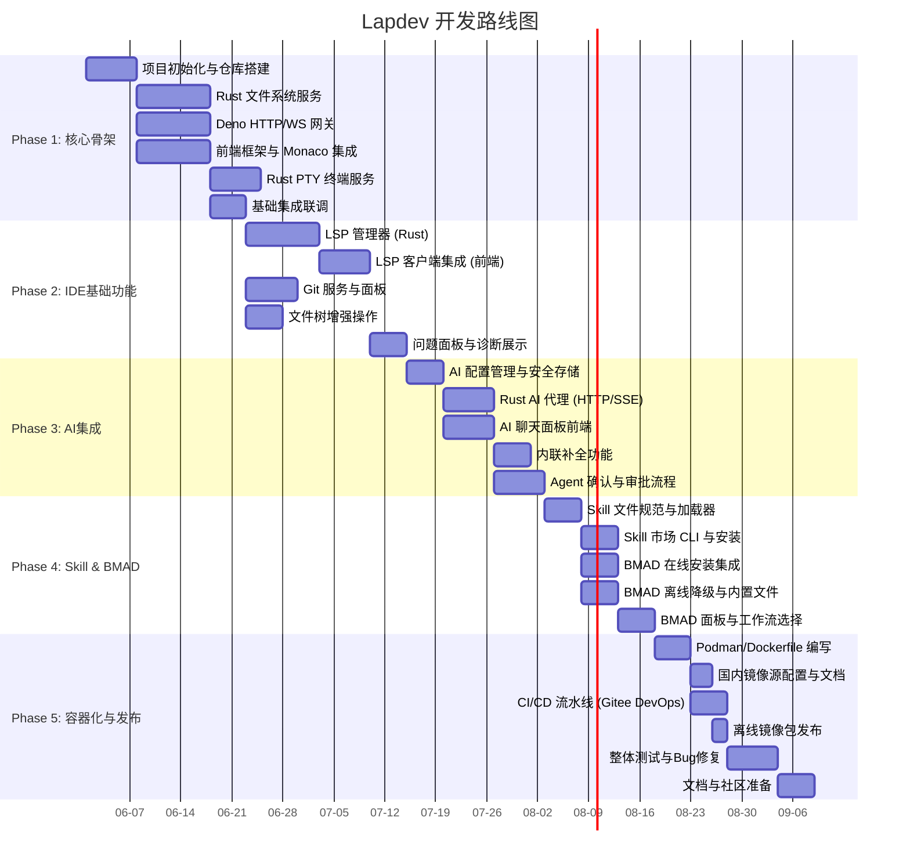
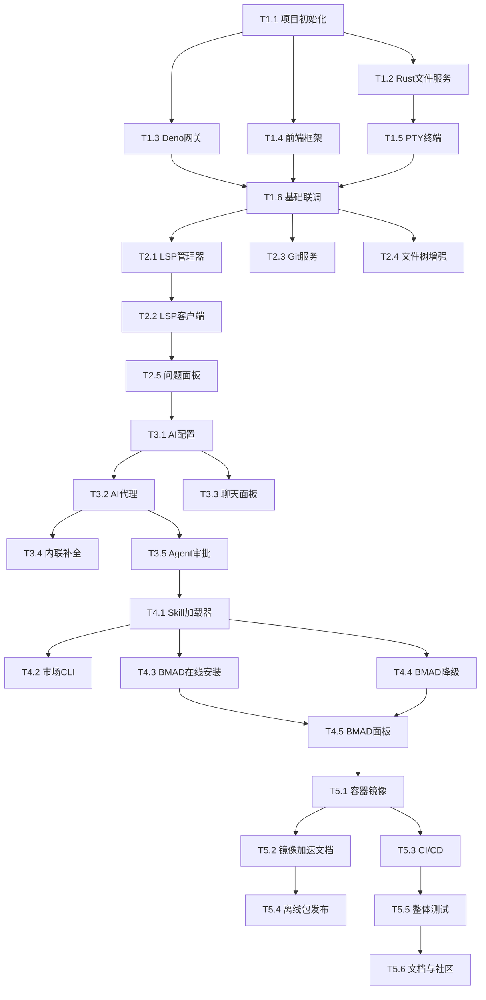

# Lapdev 项目任务分解与依赖关系

## 1. 任务分解说明
本文档将 Lapdev 的开发过程划分为 5 个阶段，总计 40+ 个可执行任务。每个任务都标明了预估工时、前置依赖和交付物。任务粒度适中，适合 2-3 人的核心团队并行推进。所有任务均在 Gitee 主仓库的 Projects 面板中进行跟踪。

## 2. 里程碑与阶段依赖

## 3. 详细任务清单

### 阶段一：核心骨架（预计 6-8 周）

| 任务编号 | 任务名称 | 描述 | 前置任务 | 预估工时 | 交付物 |
| :--- | :--- | :--- | :--- | :--- | :--- |
| **T1.1** | 项目初始化 | 创建 Gitee 仓库，搭建 monorepo 结构（lapdev-web, lapdev-server, lapdev-core），配置 Deno/TypeScript 和 Rust 开发环境，编写 README 和贡献指南。 | - | 3d | 仓库结构、构建脚本、README |
| **T1.2** | Rust 文件系统服务 | 实现 `lapdev_fs_read`, `lapdev_fs_write`, `lapdev_fs_watch` 等 FFI 函数；使用 `notify` crate 实现 inotify 文件监听；处理 .gitignore 忽略规则。 | T1.1 | 10d | `lapdev-core/src/filesystem.rs` |
| **T1.3** | Deno HTTP/WS 网关 | 使用 Deno `std/http` 和 `std/ws` 搭建基础服务器；实现 HTTP 路由（文件树 API）、WebSocket 连接管理和消息分发；加载 Rust FFI 动态库。 | T1.1 | 10d | `lapdev-server/main.ts`, `routes/`, `ws/` |
| **T1.4** | 前端框架与 Monaco 集成 | 初始化 React + TypeScript + Vite 项目；搭建 MainLayout 组件骨架；集成 Monaco Editor；实现文件树组件（静态假数据）。 | T1.1 | 10d | `lapdev-web/src/App.tsx` 等 |
| **T1.5** | Rust PTY 终端服务 | 使用 `portable-pty` 创建伪终端；实现 `lapdev_pty_spawn`, `lapdev_pty_write`, `lapdev_pty_read`, `lapdev_pty_resize`；在 Deno 侧封装为 WebSocket 终端通道。 | T1.2 | 7d | `lapdev-core/src/terminal.rs` |
| **T1.6** | 基础集成联调 | 连接文件系统服务与文件树前端；连接 PTY 服务与 xterm.js；打通文件打开与保存流程；确保 WebSocket 消息协议稳定。 | T1.3, T1.4, T1.5 | 5d | 可运行的基础 IDE 原型 |

### 阶段二：IDE 基础功能（预计 4-6 周）

| 任务编号 | 任务名称 | 描述 | 前置任务 | 预估工时 | 交付物 |
| :--- | :--- | :--- | :--- | :--- | :--- |
| **T2.1** | LSP 管理器 (Rust) | 实现 LSP 进程生命周期管理；支持 rust-analyzer 和 typescript-language-server；提供 `lapdev_lsp_start`, `lapdev_lsp_request` 等 FFI；支持诊断推送回调。 | T1.6 | 10d | `lapdev-core/src/lsp.rs` |
| **T2.2** | LSP 客户端集成 | 在 Monaco 中通过 WebSocket 发送 LSP 请求，将补全、悬停、定义跳转等结果映射到编辑器中；实现诊断波浪线渲染。 | T2.1 | 7d | 前端 LSP 适配层 |
| **T2.3** | Git 服务与面板 | 使用 `git2` crate 封装 Git 状态查询、diff、stage、commit、branch 切换；前端实现 Git 面板，展示变更文件列表与 diff 视图。 | T1.6 | 7d | `lapdev-core/src/git.rs` + GitView 组件 |
| **T2.4** | 文件树增强操作 | 实现右键菜单（新建文件/文件夹、重命名、删除）及对应的 HTTP API 后端；完善文件树自动刷新逻辑。 | T1.6 | 5d | 文件操作交互闭环 |
| **T2.5** | 问题面板与诊断展示 | 在底部面板添加“问题”标签页，收集 LSP 返回的诊断信息并按文件分组显示；支持点击跳转到对应代码行。 | T2.2 | 5d | ProblemsPanel 组件 |

### 阶段三：AI 集成（预计 4-6 周）

| 任务编号 | 任务名称 | 描述 | 前置任务 | 预估工时 | 交付物 |
| :--- | :--- | :--- | :--- | :--- | :--- |
| **T3.1** | AI 配置管理与安全存储 | 实现配置 HTTP API（保存/获取）；将 Key 存储在 Deno 会话内存；添加测试连接端点；前端实现设置界面。 | T2.5 | 5d | ConfigModal + `/api/config/ai` |
| **T3.2** | Rust AI 代理 | 使用 `reqwest` 实现流式 HTTP 请求；封装 `lapdev_ai_chat_stream` 和 `lapdev_ai_complete` FFI；处理 SSEClient 事件流；支持自定义 Base URL 和多个兼容 API 格式。 | T3.1 | 7d | `lapdev-core/src/ai.rs` |
| **T3.3** | AI 聊天面板前端 | 实现侧边栏聊天界面；支持 `@file` 和 `@selection` 上下文引用；解析流式 `ai:chat-stream` 消息并实时渲染 Markdown；提供新建/切换会话功能。 | T3.1 | 7d | AiChat 组件 |
| **T3.4** | 内联补全功能 | 在 Monaco 中监听光标位置，触发补全请求；实现幽灵文本渲染和 Tab 接受逻辑；添加设置开关。 | T3.2 | 5d | InlineCompletionProvider |
| **T3.5** | Agent 确认与审批流程 | 定义 `ai:agent-action` 消息格式；在 Rust 侧实现受控文件操作请求；前端弹窗展示 diff 并等待用户确认/拒绝；记录操作日志。 | T3.2 | 7d | Agent 授权交互闭环 |

### 阶段四：Skill 系统与 BMAD 深度集成（预计 3-4 周）

| 任务编号 | 任务名称 | 描述 | 前置任务 | 预估工时 | 交付物 |
| :--- | :--- | :--- | :--- | :--- | :--- |
| **T4.1** | Skill 文件规范与加载器 | 定义 `.skill.md` 的 YAML 头格式和 Markdown 指令体；在 Deno 侧实现递归扫描和解析逻辑；构建 Skill 注册表，供 AI 代理查询。 | T3.5 | 5d | `SkillLoader` 模块 |
| **T4.2** | Skill 市场 CLI 与安装 | 开发 `lapdev skill install` 命令，从官方市场下载 Skill；提供 `lapdev skill publish` 用于贡献；市场站点使用 Gitee Pages 部署。 | T4.1 | 5d | CLI 工具 + 市场首页 |
| **T4.3** | BMAD 在线安装集成 | 调用 `npx bmad-method install`；处理成功/失败状态；成功后自动注册 BMAD 技能；前端提供“启用 BMAD”按钮。 | T4.1 | 5d | `bmad.ts` 服务 |
| **T4.4** | BMAD 离线降级 | 将内置简化版文件编译进 Rust 二进制/动态库；实现 `lapdev_bmad_fallback_install` 写入文件；降级后仍注册基本技能。 | T4.1 | 5d | 内置 BMAD 文件 + 降级逻辑 |
| **T4.5** | BMAD 面板与工作流选择 | 前端实现 BMAD 面板，列出可用工作流和智能体；允许用户一键启动某个工作流（如快速流程）；支持切换内嵌/完整 BMAD 模式。 | T4.3, T4.4 | 5d | BmadPanel 组件 |

### 阶段五：容器化、发布与社区（预计 3-4 周）

| 任务编号 | 任务名称 | 描述 | 前置任务 | 预估工时 | 交付物 |
| :--- | :--- | :--- | :--- | :--- | :--- |
| **T5.1** | 容器镜像构建 | 编写多阶段 Dockerfile（基于 node:20-alpine，预装 Deno、Rust 工具链）；生成 `podman-compose.yml`；测试容器内 IDE 功能完整。 | T4.5 | 5d | `Dockerfile`, `podman-compose.yml` |
| **T5.2** | 国内镜像加速与文档 | 编写 Podman 部署指南，重点说明国内镜像源配置（阿里云、中科大等）；推送官方镜像到阿里云 ACR；提供离线镜像包打包脚本。 | T5.1 | 3d | 部署文档 + 离线包 |
| **T5.3** | CI/CD 流水线 | 在 Gitee DevOps 中配置流水线：代码检查、测试、构建镜像、推送至 ACR；设置 GitHub 自动同步。 | T5.1 | 5d | `.gitee-ci.yml` 或 Jenkinsfile |
| **T5.4** | 离线镜像包发布 | 使用 `podman save` 导出镜像并压缩，上传至 Gitee Releases；脚本支持自动化增量更新。 | T5.2 | 2d | `lapdev-latest.tar.xz` |
| **T5.5** | 整体测试与 Bug 修复 | 执行验收标准中所有场景测试（含离线 BMAD 降级、AI 代理、多用户终终端）；修复发现的阻塞性缺陷；性能压测。 | T5.3 | 7d | 测试报告 + 稳定版本 |
| **T5.6** | 文档与社区准备 | 完善用户手册、开发指南、Skill 编写教程；准备 Gitee 首页展示；在相关社区发布消息。 | T5.5 | 5d | 全套文档 + 社区公告 |

## 4. 任务依赖关系图

## 5. 迭代建议与人员配置

- **阶段一**：建议 3 人分别负责 Rust 核心、Deno 网关、前端框架，约 4-5 周完成。
- **阶段二**：前端和 Rust 开发者合作完成 LSP/Git 功能，约 4 周。
- **阶段三**：熟悉 AI API 的开发者主攻 Rust AI 代理，前端同步开发聊天与补全，约 4 周。
- **阶段四**：全栈开发者实现 Skill 系统与 BMAD 集成，约 3 周。
- **阶段五**：DevOps 背景的开发者负责容器化与 CI/CD，全员参与测试与文档，约 3-4 周。

合计核心开发周期约 **18-20 周**（可根据团队规模调整）。
